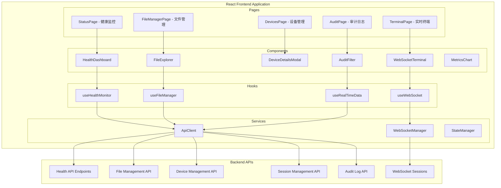

# Design Document

## Overview

前端增强功能设计基于现有的 React + TypeScript 架构，采用组件化设计模式，通过完善的 API 客户端与后端服务集成。设计重点关注用户体验、实时数据更新、错误处理和响应式界面。系统将新增 6 个主要功能模块：系统健康监控、文件管理、设备详情增强、WebSocket 实时终端、高级审计筛选和数据可视化，每个模块都具备完整的 UI 组件和状态管理机制。

## Architecture

### 前端架构图



### 技术栈和依赖

```typescript
// 核心技术栈
interface TechStack {
  framework: "React 18";
  language: "TypeScript";
  styling: "Tailwind CSS";
  routing: "React Router";
  stateManagement: "React Context + useReducer";
  httpClient: "Axios";
  websocket: "Native WebSocket API";
  charts: "Chart.js / Recharts";
  icons: "Lucide React";
  dateHandling: "date-fns";
  fileHandling: "File API";
}

// 新增依赖
interface NewDependencies {
  charts: "@chartjs/react" | "recharts";
  terminal: "@xterm/xterm" | "react-terminal-ui-kit";
  fileUpload: "react-dropzone";
  notifications: "react-hot-toast";
  virtualization: "react-window"; // 大数据列表优化
}
```

## Components and Interfaces

### 1. 系统健康监控组件

#### HealthDashboard 组件
```typescript
interface HealthDashboardProps {
  refreshInterval?: number; // 默认 30 秒
  showMetrics?: boolean;
  compactMode?: boolean;
}

interface HealthData {
  status: 'healthy' | 'degraded' | 'unhealthy';
  timestamp: number;
  version: string;
  environment: string;
  checks: {
    database: HealthStatus;
    kv: HealthStatus;
    r2: HealthStatus;
    durableObjects: HealthStatus;
    secrets: HealthStatus;
  };
  metrics?: SystemMetrics;
}

interface HealthStatus {
  status: 'healthy' | 'degraded' | 'unhealthy';
  responseTime?: number;
  error?: string;
  lastCheck: number;
}

interface SystemMetrics {
  uptime: number;
  requestCount: number;
  errorRate: number;
  averageResponseTime: number;
  activeConnections: number;
  memoryUsage?: number;
}
```

#### MetricsChart 组件
```typescript
interface MetricsChartProps {
  metrics: SystemMetrics[];
  timeRange: '1h' | '6h' | '24h' | '7d';
  chartType: 'line' | 'area' | 'bar';
  showLegend?: boolean;
}

interface ChartDataPoint {
  timestamp: number;
  responseTime: number;
  errorRate: number;
  activeConnections: number;
}
```

### 2. 文件管理组件

#### FileExplorer 组件
```typescript
interface FileExplorerProps {
  deviceId: string;
  initialPath?: string;
  allowUpload?: boolean;
  allowDownload?: boolean;
  maxFileSize?: number; // bytes
}

interface FileInfo {
  name: string;
  path: string;
  type: 'file' | 'directory';
  size: number;
  modified: number;
  permissions: string;
  owner?: string;
}

interface FileOperation {
  type: 'list' | 'download' | 'upload' | 'delete';
  path: string;
  status: 'pending' | 'progress' | 'success' | 'error';
  progress?: number;
  error?: string;
}
```

#### FileUploadZone 组件
```typescript
interface FileUploadZoneProps {
  deviceId: string;
  targetPath: string;
  onUploadComplete: (files: FileInfo[]) => void;
  onUploadError: (error: string) => void;
  maxFiles?: number;
  maxFileSize?: number;
  acceptedTypes?: string[];
}

interface UploadProgress {
  file: File;
  progress: number;
  status: 'uploading' | 'success' | 'error';
  error?: string;
}
```

### 3. 设备详情增强组件

#### DeviceDetailsModal 增强版
```typescript
interface EnhancedDeviceDetailsProps {
  deviceId: string;
  isOpen: boolean;
  onClose: () => void;
  autoRefresh?: boolean;
  refreshInterval?: number;
}

interface DetailedDeviceInfo extends Device {
  systemInfo: {
    os: string;
    version: string;
    architecture: string;
    hostname: string;
    uptime: number;
  };
  hardwareInfo: {
    cpu: {
      model: string;
      cores: number;
      usage: number;
    };
    memory: {
      total: number;
      used: number;
      available: number;
    };
    disk: Array<{
      device: string;
      mountpoint: string;
      total: number;
      used: number;
      available: number;
    }>;
  };
  networkInfo: {
    interfaces: Array<{
      name: string;
      type: string;
      ipAddress: string;
      macAddress: string;
      status: 'up' | 'down';
    }>;
    connections: number;
  };
  agentInfo: {
    version: string;
    startTime: number;
    configPath: string;
    logLevel: string;
    features: string[];
  };
}
```

#### SystemInfoCard 组件
```typescript
interface SystemInfoCardProps {
  title: string;
  data: Record<string, any>;
  icon?: React.ComponentType;
  refreshable?: boolean;
  onRefresh?: () => void;
}
```

### 4. WebSocket 实时终端组件

#### WebSocketTerminal 组件
```typescript
interface WebSocketTerminalProps {
  deviceId: string;
  sessionId?: string;
  autoConnect?: boolean;
  theme?: 'dark' | 'light';
  fontSize?: number;
}

interface TerminalSession {
  id: string;
  deviceId: string;
  websocket: WebSocket | null;
  status: 'connecting' | 'connected' | 'disconnected' | 'error';
  history: TerminalMessage[];
  currentCommand?: string;
}

interface TerminalMessage {
  id: string;
  type: 'command' | 'output' | 'error' | 'system';
  content: string;
  timestamp: number;
  exitCode?: number;
}

interface CommandExecution {
  id: string;
  command: string;
  startTime: number;
  endTime?: number;
  exitCode?: number;
  stdout: string;
  stderr: string;
}
```

#### TerminalInput 组件
```typescript
interface TerminalInputProps {
  onCommand: (command: string) => void;
  disabled?: boolean;
  placeholder?: string;
  history: string[];
}
```

### 5. 高级审计筛选组件

#### AuditFilter 增强版
```typescript
interface EnhancedAuditFilterProps {
  onFiltersChange: (filters: AuditFilters) => void;
  initialFilters?: AuditFilters;
  showExport?: boolean;
}

interface AuditFilters {
  deviceId?: string;
  actionType?: string[];
  dateRange?: {
    start: Date;
    end: Date;
  };
  severity?: 'info' | 'warning' | 'error';
  search?: string;
  limit?: number;
  offset?: number;
}

interface AuditLogEntry {
  id: number;
  deviceId: string;
  sessionId?: string;
  actionType: string;
  actionData?: any;
  result?: string;
  timestamp: number;
  severity: 'info' | 'warning' | 'error';
  userAgent?: string;
  ipAddress?: string;
}
```

#### AuditExport 组件
```typescript
interface AuditExportProps {
  filters: AuditFilters;
  format: 'csv' | 'json' | 'xlsx';
  onExportComplete: (filename: string) => void;
  onExportError: (error: string) => void;
}
```

### 6. WebSocket 管理服务

#### WebSocketManager 类
```typescript
class WebSocketManager {
  private connections: Map<string, WebSocket>;
  private reconnectAttempts: Map<string, number>;
  private heartbeatIntervals: Map<string, NodeJS.Timeout>;
  
  constructor(
    private baseUrl: string,
    private maxReconnectAttempts: number = 5,
    private heartbeatInterval: number = 30000
  ) {}
  
  async connect(deviceId: string, sessionId: string): Promise<WebSocket>;
  disconnect(sessionId: string): void;
  send(sessionId: string, message: any): boolean;
  onMessage(sessionId: string, handler: (message: any) => void): void;
  onStatusChange(sessionId: string, handler: (status: ConnectionStatus) => void): void;
  
  private handleReconnect(sessionId: string): void;
  private startHeartbeat(sessionId: string): void;
  private stopHeartbeat(sessionId: string): void;
}

interface ConnectionStatus {
  status: 'connecting' | 'connected' | 'disconnected' | 'error';
  lastConnected?: number;
  reconnectAttempts: number;
  error?: string;
}
```

## Data Models

### 前端状态管理

#### 全局状态结构
```typescript
interface AppState {
  health: HealthState;
  devices: DevicesState;
  files: FilesState;
  sessions: SessionsState;
  audit: AuditState;
  ui: UIState;
}

interface HealthState {
  current: HealthData | null;
  history: HealthData[];
  loading: boolean;
  error: string | null;
  lastUpdate: number;
}

interface DevicesState {
  devices: Device[];
  selectedDevice: DetailedDeviceInfo | null;
  loading: boolean;
  error: string | null;
}

interface FilesState {
  currentPath: string;
  files: FileInfo[];
  operations: FileOperation[];
  loading: boolean;
  error: string | null;
}

interface SessionsState {
  sessions: TerminalSession[];
  activeSession: string | null;
  loading: boolean;
  error: string | null;
}

interface AuditState {
  logs: AuditLogEntry[];
  filters: AuditFilters;
  total: number;
  loading: boolean;
  error: string | null;
}

interface UIState {
  notifications: Notification[];
  modals: {
    deviceDetails: boolean;
    fileUpload: boolean;
    sessionCreate: boolean;
  };
  theme: 'light' | 'dark';
  sidebarCollapsed: boolean;
}
```

### API 响应格式标准化

#### 统一响应格式
```typescript
interface ApiResponse<T> {
  success: boolean;
  data?: T;
  error?: string;
  message?: string;
  timestamp: number;
  requestId?: string;
}

interface PaginatedResponse<T> extends ApiResponse<T[]> {
  pagination: {
    total: number;
    limit: number;
    offset: number;
    hasMore: boolean;
  };
}

interface HealthApiResponse extends ApiResponse<HealthData> {
  checks: Record<string, HealthStatus>;
  metrics?: SystemMetrics;
}
```

### WebSocket 消息协议

#### 消息类型定义
```typescript
type WebSocketMessage = 
  | AuthMessage
  | CommandMessage
  | CommandResultMessage
  | FileListMessage
  | FileListResultMessage
  | FileGetMessage
  | FileGetResultMessage
  | FilePutMessage
  | FilePutResultMessage
  | PresenceMessage
  | ErrorMessage
  | HeartbeatMessage;

interface AuthMessage {
  type: 'auth';
  deviceId: string;
  sessionId: string;
  signature: string;
}

interface CommandMessage {
  type: 'cmd';
  id: string;
  command: string;
  args: string[];
  timeout?: number;
}

interface CommandResultMessage {
  type: 'cmd_result';
  id: string;
  exitCode: number;
  stdout: string;
  stderr: string;
  duration: number;
}

interface HeartbeatMessage {
  type: 'heartbeat';
  timestamp: number;
}
```

现在让我使用 prework 工具来分析验收标准的可测试性：

<function_calls>
<invoke name="prework">
<parameter name="featureName">frontend-enhancements

## Correctness Properties

*属性是一个特征或行为，应该在系统的所有有效执行中保持为真——本质上是关于系统应该做什么的正式陈述。属性作为人类可读规范和机器可验证正确性保证之间的桥梁。*

基于需求分析，我们识别出以下可测试的正确性属性：

### Property 1: 健康状态 API 调用正确性
*对于任何* StatusPage 组件的渲染，应该正确调用 GET /health API 并显示返回的健康状态数据
**Validates: Requirements 1.1**

### Property 2: 详细健康信息获取
*对于任何* 用户请求详细健康信息的操作，应该触发 GET /health/detailed API 调用并正确显示详细系统信息
**Validates: Requirements 1.2**

### Property 3: 就绪检查 API 集成
*对于任何* 系统就绪检查请求，应该调用 GET /health/ready API 并正确显示服务就绪状态
**Validates: Requirements 1.3**

### Property 4: 存活检查 API 集成
*对于任何* 系统存活检查请求，应该调用 GET /health/live API 并正确显示服务存活状态
**Validates: Requirements 1.4**

### Property 5: 系统指标显示
*对于任何* 系统指标查看请求，应该调用 GET /metrics API 并正确解析显示 Prometheus 格式的指标数据
**Validates: Requirements 1.5**

### Property 6: 健康状态实时更新
*对于任何* 健康状态变化，StatusPage 应该实时更新状态显示并提供相应的视觉反馈
**Validates: Requirements 1.6**

### Property 7: 健康检查错误处理
*对于任何* 健康检查失败的情况，应该显示用户友好的错误信息和建议的解决方案
**Validates: Requirements 1.7**

### Property 8: 文件列表 API 调用
*对于任何* 设备选择和文件列表请求，FileManager 应该调用 POST /files/list API 并正确显示目录内容
**Validates: Requirements 2.2**

### Property 9: 文件下载功能
*对于任何* 文件下载操作，应该调用 GET /files/download API 并正确处理文件下载流程
**Validates: Requirements 2.3**

### Property 10: 文件上传功能
*对于任何* 文件上传操作，应该调用 POST /files/upload API 并正确处理文件上传到指定路径
**Validates: Requirements 2.4**

### Property 11: 文件操作进度显示
*对于任何* 进行中的文件操作，应该显示适当的进度指示器和操作状态反馈
**Validates: Requirements 2.5**

### Property 12: 文件操作完成更新
*对于任何* 完成的文件操作，应该更新文件列表并显示操作结果
**Validates: Requirements 2.6**

### Property 13: 文件操作错误处理
*对于任何* 失败的文件操作，应该显示详细错误信息和重试选项
**Validates: Requirements 2.7**

### Property 14: 设备详情 API 调用
*对于任何* 设备详情查看请求，DeviceDetails 应该调用 GET /devices/{device_id} API 并获取完整设备信息
**Validates: Requirements 3.1**

### Property 15: 设备信息展示完整性
*对于任何* 设备详情显示，应该正确展示系统信息、Agent 信息和运行状态
**Validates: Requirements 3.2**

### Property 16: 硬件信息格式化显示
*对于任何* 硬件信息显示，应该正确格式化显示 CPU、内存、磁盘等硬件详情
**Validates: Requirements 3.3**

### Property 17: 网络信息展示
*对于任何* 网络信息显示，应该正确展示网络配置、连接状态和网络统计
**Validates: Requirements 3.4**

### Property 18: Agent 状态显示
*对于任何* Agent 状态显示，应该正确显示 Agent 版本、运行时间和配置信息
**Validates: Requirements 3.5**

### Property 19: 设备信息更新机制
*对于任何* 设备信息更新请求，应该支持手动刷新和自动更新机制
**Validates: Requirements 3.6**

### Property 20: 设备离线状态处理
*对于任何* 离线设备，应该正确显示最后在线时间和离线原因
**Validates: Requirements 3.7**

### Property 21: WebSocket 连接建立
*对于任何* 终端会话创建请求，WebSocketTerminal 应该正确建立到指定设备的 WebSocket 连接
**Validates: Requirements 4.1**

### Property 22: 终端界面显示
*对于任何* 成功建立的 WebSocket 连接，应该显示终端界面和连接状态指示器
**Validates: Requirements 4.2**

### Property 23: 命令发送机制
*对于任何* 用户输入的命令，应该通过 WebSocket 正确发送到远程设备
**Validates: Requirements 4.3**

### Property 24: 实时输出显示
*对于任何* 远程设备返回的输出，应该在终端中实时显示命令执行结果
**Validates: Requirements 4.4**

### Property 25: 命令完成状态显示
*对于任何* 完成的命令执行，应该显示退出码和执行时间
**Validates: Requirements 4.5**

### Property 26: WebSocket 断开处理
*对于任何* WebSocket 连接断开情况，应该显示断开状态并提供重连选项
**Validates: Requirements 4.6**

### Property 27: 终端心跳机制
*对于任何* 空闲的终端会话，应该发送心跳消息保持连接活跃
**Validates: Requirements 4.7**

### Property 28: 会话详情获取
*对于任何* 会话详情查看请求，SessionManager 应该调用 GET /sessions/{session_id} API 获取会话信息
**Validates: Requirements 5.1**

### Property 29: 会话信息展示
*对于任何* 会话详情显示，应该正确展示会话状态、连接时间和活动历史
**Validates: Requirements 5.2**

### Property 30: 会话终止功能
*对于任何* 会话终止请求，应该调用 DELETE /sessions/{session_id} API 正确结束会话
**Validates: Requirements 5.3**

### Property 31: 会话状态实时更新
*对于任何* 会话状态变化，应该实时更新会话状态显示
**Validates: Requirements 5.4**

### Property 32: 会话异常处理
*对于任何* 会话异常情况，应该显示异常信息和诊断建议
**Validates: Requirements 5.5**

### Property 33: 多会话管理
*对于任何* 多会话管理需求，应该提供会话列表和批量操作功能
**Validates: Requirements 5.6**

### Property 34: 会话超时清理
*对于任何* 超时的会话，应该自动清理过期会话并更新界面
**Validates: Requirements 5.7**

### Property 35: 审计筛选功能
*对于任何* 按设备的审计日志筛选，应该支持按 device_id 参数正确筛选审计日志
**Validates: Requirements 6.2**

### Property 36: 操作类型筛选
*对于任何* 按操作类型的筛选，应该支持按 action_type 参数正确筛选日志记录
**Validates: Requirements 6.3**

### Property 37: 时间范围筛选
*对于任何* 按时间范围的筛选，应该支持按时间范围参数正确筛选日志
**Validates: Requirements 6.4**

### Property 38: 审计搜索和分页
*对于任何* 审计日志搜索请求，应该调用审计 API 并支持分页功能
**Validates: Requirements 6.5**

### Property 39: 审计结果格式化
*对于任何* 审计搜索结果，应该正确格式化显示日志详情和操作上下文
**Validates: Requirements 6.6**

### Property 40: 审计日志导出
*对于任何* 审计日志导出请求，应该支持将筛选结果导出为 CSV 或 JSON 格式
**Validates: Requirements 6.7**

### Property 41: WebSocket 消息处理
*对于任何* WebSocket 连接，应该实现完整的消息处理和路由机制
**Validates: Requirements 7.1**

### Property 42: 命令消息处理
*对于任何* 命令执行消息，应该支持命令发送、结果接收和错误处理
**Validates: Requirements 7.2**

### Property 43: 文件操作消息处理
*对于任何* 文件操作消息，应该支持文件传输和进度跟踪
**Validates: Requirements 7.3**

### Property 44: 双向通信支持
*对于任何* 实时通信需求，应该支持双向消息传递和状态同步
**Validates: Requirements 7.4**

### Property 45: WebSocket 异常恢复
*对于任何* WebSocket 连接异常，应该实现自动重连和错误恢复机制
**Validates: Requirements 7.5**

### Property 46: 消息队列管理
*对于任何* 消息队列积压情况，应该实现消息缓冲和优先级处理
**Validates: Requirements 7.6**

### Property 47: 多会话资源管理
*对于任何* 会话管理需求，应该支持多会话管理和资源清理
**Validates: Requirements 7.7**

### Property 48: 页面加载性能
*对于任何* 页面加载请求，应该在 2 秒内显示主要内容和加载状态
**Validates: Requirements 8.1**

### Property 49: API 调用加载状态
*对于任何* 进行中的 API 调用，应该显示适当的加载指示器和进度反馈
**Validates: Requirements 8.2**

### Property 50: 操作完成反馈
*对于任何* 完成的操作，应该提供明确的成功或失败反馈
**Validates: Requirements 8.3**

### Property 51: 用户友好错误处理
*对于任何* 发生的错误，应该显示用户友好的错误信息和解决建议
**Validates: Requirements 8.4**

### Property 52: 乐观更新机制
*对于任何* 数据更新操作，应该实现乐观更新和数据同步机制
**Validates: Requirements 8.5**

### Property 53: 交互即时反馈
*对于任何* 用户交互操作，应该提供即时的视觉反馈和状态变化
**Validates: Requirements 8.6**

### Property 54: 响应式设计支持
*对于任何* 移动设备访问，应该支持响应式设计和触摸操作
**Validates: Requirements 8.7**

### Property 55: 指标数据可视化
*对于任何* 系统指标显示，应该使用图表组件正确可视化 Prometheus 指标数据
**Validates: Requirements 9.1**

### Property 56: 设备状态统计图表
*对于任何* 设备状态统计显示，应该正确展示设备在线/离线状态的饼图或柱状图
**Validates: Requirements 9.2**

### Property 57: 历史趋势图表
*对于任何* 历史趋势显示，应该正确绘制设备连接数和活动趋势的时间序列图
**Validates: Requirements 9.3**

### Property 58: 审计统计可视化
*对于任何* 审计统计显示，应该正确可视化操作类型分布和频率统计
**Validates: Requirements 9.4**

### Property 59: 图表实时更新
*对于任何* 数据更新，Dashboard 应该实时更新图表数据和视觉效果
**Validates: Requirements 9.5**

### Property 60: 图表交互功能
*对于任何* 图表用户交互，应该支持图表缩放、筛选和详情查看
**Validates: Requirements 9.6**

### Property 61: 图表导出功能
*对于任何* 图表导出请求，应该支持将图表导出为图片或 PDF 格式
**Validates: Requirements 9.7**

### Property 62: 配置验证机制
*对于任何* 配置修改操作，应该验证配置值的有效性和格式
**Validates: Requirements 10.2**

### Property 63: 配置保存 API 调用
*对于任何* 配置保存操作，应该调用相应 API 正确更新系统配置
**Validates: Requirements 10.3**

### Property 64: 配置更新结果显示
*对于任何* 配置更新操作，应该显示更新结果和生效状态
**Validates: Requirements 10.4**

### Property 65: 配置冲突处理
*对于任何* 配置冲突情况，应该显示冲突信息和解决建议
**Validates: Requirements 10.5**

### Property 66: 默认配置恢复
*对于任何* 默认配置恢复请求，应该支持重置配置到默认值
**Validates: Requirements 10.6**

### Property 67: 配置备份功能
*对于任何* 配置备份需求，应该支持配置的导出和导入功能
**Validates: Requirements 10.7**

## Error Handling

### 前端错误处理策略

#### 1. API 错误处理
```typescript
interface ErrorHandlingStrategy {
  // 网络错误
  networkErrors: {
    timeout: "显示超时提示，提供重试选项";
    offline: "显示离线状态，启用离线模式";
    serverError: "显示服务器错误，记录错误日志";
  };
  
  // 认证错误
  authErrors: {
    unauthorized: "重定向到登录页面";
    forbidden: "显示权限不足提示";
    tokenExpired: "自动刷新 token 或重新登录";
  };
  
  // 业务逻辑错误
  businessErrors: {
    validation: "显示字段级别的验证错误";
    conflict: "显示冲突信息和解决建议";
    notFound: "显示资源不存在提示";
  };
}
```

#### 2. WebSocket 错误处理
```typescript
interface WebSocketErrorHandling {
  connectionErrors: {
    failedToConnect: "显示连接失败，提供重试按钮";
    connectionLost: "自动重连，显示重连状态";
    authenticationFailed: "显示认证失败，要求重新认证";
  };
  
  messageErrors: {
    invalidMessage: "忽略无效消息，记录警告";
    messageTimeout: "显示消息超时，提供重发选项";
    protocolError: "显示协议错误，建议刷新页面";
  };
}
```

#### 3. 用户体验错误处理
```typescript
interface UXErrorHandling {
  // 优雅降级
  gracefulDegradation: {
    chartLoadFailed: "显示表格形式的数据";
    imageLoadFailed: "显示占位符图片";
    featureUnavailable: "隐藏功能，显示替代方案";
  };
  
  // 错误恢复
  errorRecovery: {
    autoRetry: "自动重试失败的操作";
    manualRetry: "提供手动重试按钮";
    fallbackMode: "启用简化模式";
  };
  
  // 用户反馈
  userFeedback: {
    toast: "显示简短的成功/错误提示";
    modal: "显示详细的错误信息对话框";
    inline: "在相关组件内显示错误状态";
  };
}
```

### 错误边界和恢复机制

#### React 错误边界
```typescript
interface ErrorBoundaryProps {
  fallback?: React.ComponentType<{error: Error; retry: () => void}>;
  onError?: (error: Error, errorInfo: ErrorInfo) => void;
  children: React.ReactNode;
}

class ErrorBoundary extends React.Component<ErrorBoundaryProps, {hasError: boolean}> {
  // 捕获组件树中的 JavaScript 错误
  // 提供错误恢复机制
  // 记录错误信息用于调试
}
```

#### 异步操作错误处理
```typescript
interface AsyncErrorHandling {
  // Promise 错误处理
  promiseErrors: {
    catch: "使用 .catch() 处理 Promise 拒绝";
    finally: "使用 .finally() 清理资源";
    timeout: "设置操作超时时间";
  };
  
  // React Query 错误处理
  queryErrors: {
    retry: "配置自动重试策略";
    staleTime: "设置数据过期时间";
    errorBoundary: "使用错误边界捕获查询错误";
  };
}
```

## Testing Strategy

### 双重测试方法

前端增强功能采用单元测试和基于属性的测试相结合的方法：

- **单元测试**：验证组件渲染、用户交互和 API 调用
- **属性测试**：验证组件在各种输入下的行为一致性
- **集成测试**：验证组件间的协作和数据流
- **端到端测试**：验证完整的用户工作流程

### 测试框架和工具

#### 核心测试技术栈
```typescript
interface TestingStack {
  unitTesting: "Jest + React Testing Library";
  propertyTesting: "fast-check";
  e2eTesting: "Playwright";
  visualTesting: "Chromatic / Percy";
  apiMocking: "MSW (Mock Service Worker)";
  webSocketMocking: "ws + mock-socket";
}
```

#### 属性测试配置
- **测试框架**：使用 `fast-check` 进行基于属性的测试
- **最小迭代次数**：每个属性测试至少 100 次迭代
- **测试标记格式**：`Feature: frontend-enhancements, Property {number}: {property_text}`

### 组件测试策略

#### 1. 健康监控组件测试
```typescript
// 单元测试示例
describe('HealthDashboard', () => {
  test('renders health status correctly', () => {
    // 测试健康状态正确渲染
  });
  
  test('calls health API on mount', () => {
    // 测试组件挂载时调用健康检查 API
  });
  
  test('handles API errors gracefully', () => {
    // 测试 API 错误处理
  });
});

// 属性测试示例
describe('HealthDashboard Properties', () => {
  test('Property 1: Health API call correctness', () => {
    fc.assert(fc.property(
      fc.record({
        status: fc.constantFrom('healthy', 'degraded', 'unhealthy'),
        timestamp: fc.integer(),
        checks: fc.record({})
      }),
      (healthData) => {
        // 验证任何健康数据都能正确渲染
      }
    ));
  });
});
```

#### 2. WebSocket 终端测试
```typescript
describe('WebSocketTerminal Properties', () => {
  test('Property 21: WebSocket connection establishment', () => {
    fc.assert(fc.property(
      fc.string(),
      fc.string(),
      (deviceId, sessionId) => {
        // 验证任何有效的设备ID和会话ID都能建立连接
      }
    ));
  });
  
  test('Property 23: Command sending mechanism', () => {
    fc.assert(fc.property(
      fc.string().filter(s => s.trim().length > 0),
      (command) => {
        // 验证任何有效命令都能通过 WebSocket 发送
      }
    ));
  });
});
```

#### 3. 文件管理组件测试
```typescript
describe('FileExplorer Properties', () => {
  test('Property 8: File list API call', () => {
    fc.assert(fc.property(
      fc.string(),
      fc.string(),
      (deviceId, path) => {
        // 验证任何设备ID和路径都能触发正确的API调用
      }
    ));
  });
});
```

### 集成测试策略

#### API 集成测试
```typescript
describe('API Integration', () => {
  beforeEach(() => {
    // 设置 MSW 模拟服务器
    server.listen();
  });
  
  test('Health monitoring workflow', async () => {
    // 测试完整的健康监控工作流程
  });
  
  test('File management workflow', async () => {
    // 测试完整的文件管理工作流程
  });
});
```

#### WebSocket 集成测试
```typescript
describe('WebSocket Integration', () => {
  test('Terminal session lifecycle', async () => {
    // 测试终端会话的完整生命周期
  });
  
  test('Command execution flow', async () => {
    // 测试命令执行的完整流程
  });
});
```

### 端到端测试场景

#### 关键用户工作流程
```typescript
// Playwright E2E 测试
test('Complete health monitoring workflow', async ({ page }) => {
  // 1. 访问健康监控页面
  // 2. 查看基础健康状态
  // 3. 请求详细健康信息
  // 4. 查看系统指标
  // 5. 验证实时更新
});

test('File management workflow', async ({ page }) => {
  // 1. 访问文件管理页面
  // 2. 选择设备
  // 3. 浏览文件列表
  // 4. 下载文件
  // 5. 上传文件
  // 6. 验证操作结果
});

test('WebSocket terminal workflow', async ({ page }) => {
  // 1. 创建终端会话
  // 2. 建立 WebSocket 连接
  // 3. 执行命令
  // 4. 查看实时输出
  // 5. 处理连接断开和重连
});
```

### 性能测试

#### 前端性能指标
```typescript
interface PerformanceMetrics {
  loadTime: "页面加载时间 < 2秒";
  apiResponseTime: "API 响应处理 < 500ms";
  renderTime: "组件渲染时间 < 100ms";
  memoryUsage: "内存使用增长 < 10MB/小时";
  webSocketLatency: "WebSocket 消息延迟 < 50ms";
}
```

#### 压力测试场景
- 大量设备列表渲染性能
- 长时间 WebSocket 连接稳定性
- 大文件上传下载性能
- 实时数据更新频率测试
- 多标签页并发操作测试

每个测试场景都有对应的属性测试来验证系统在各种条件下的正确行为和性能表现。