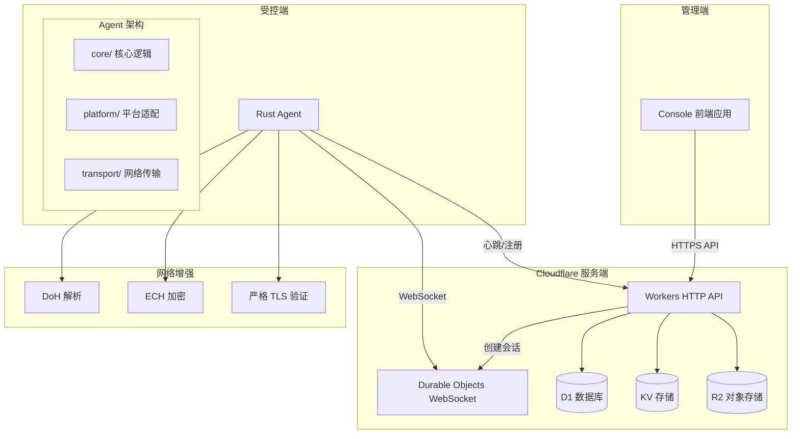

# Design Document

## Overview

轻量化 RMM 系统采用三端架构设计：服务端基于 Cloudflare Workers 提供 HTTP API 和 WebSocket 会话管理，受控端 Agent 使用 Rust 实现跨平台支持，管理端 Console 为独立前端应用。系统通过 Ed25519 签名、TLS 验证、DoH/ECH 等多层安全机制确保通信安全，支持本地开发与云端资源的混合测试模式。

## Architecture

### 系统架构图



### Cloudflare 平台约束与反踩坑规则

1. **Workers/DO 适用性限制**
   - 适合：控制面 API、小消息传输、会话协调
   - 不适合：大文件传输、视频流、高吞吐量数据传输
   - 设计原则：分期实现，设置合理限额

2. **Console 数据访问约束**
   - 禁止：Console 直连 D1（避免 Pages 本地远程 D1 限制）
   - 要求：所有数据访问必须通过 Worker API
   - 好处：跨环境一致性、统一权限控制

3. **本地开发架构**
   - 服务端：wrangler dev（本地 runtime）+ Remote bindings（云端资源）
   - 前端：本地运行，通过 API_BASE_URL 配置连接服务端
   - 测试：本地 runtime + 真实云端 D1/KV/R2 的混合模式

## Components and Interfaces

### 服务端组件

#### Workers HTTP API
```typescript
// 核心 API 端点
interface WorkerAPI {
  // 设备管理
  'POST /agent/enroll': (token: string) => EnrollResponse
  'POST /agent/heartbeat': (heartbeat: HeartbeatRequest) => HeartbeatResponse
  
  // 会话管理
  'POST /sessions': (deviceId: string) => SessionResponse
  'GET /sessions/:id': () => SessionStatus
  
  // 文件管理
  'POST /files/list': (path: string) => FileListResponse
  'GET /files/download': (path: string) => FileContent
  'POST /files/upload': (file: FileData) => UploadResponse
  
  // 审计日志
  'GET /audit': (filters: AuditFilters) => AuditResponse
}
```

#### Durable Objects WebSocket 会话
```typescript
interface SessionDurableObject {
  // WebSocket 连接管理
  handleWebSocket(websocket: WebSocket): void
  
  // 消息路由
  routeMessage(message: WSMessage): void
  
  // 会话状态管理
  getSessionState(): SessionState
  cleanupSession(): void
}
```

### Agent 跨平台架构

#### 核心模块结构
```rust
// core/ - 平台无关核心逻辑
mod core {
    pub mod protocol;     // 协议实现
    pub mod crypto;       // 加密签名
    pub mod scheduler;    // 任务调度
    pub mod state;        // 状态管理
    pub mod reconnect;    // 重连逻辑
}

// platform/ - 平台相关实现
mod platform {
    pub trait CommandExecutor {
        fn execute(&self, cmd: &str) -> Result<Output>;
    }
    
    pub trait FileSystem {
        fn list_files(&self, path: &Path) -> Result<Vec<FileInfo>>;
        fn read_file(&self, path: &Path) -> Result<Vec<u8>>;
        fn write_file(&self, path: &Path, data: &[u8]) -> Result<()>;
    }
    
    #[cfg(target_os = "windows")]
    mod windows;
    
    #[cfg(target_os = "linux")]
    mod linux;
    
    #[cfg(target_os = "macos")]
    mod macos;
}

// transport/ - 网络传输层
mod transport {
    pub struct HttpClient {
        doh_resolver: Option<DohResolver>,
        ech_config: Option<EchConfig>,
        tls_config: TlsConfig,
    }
    
    pub struct WebSocketClient {
        reconnect_strategy: ReconnectStrategy,
        heartbeat_interval: Duration,
    }
}
```

#### Feature Flags 配置
```toml
[features]
default = ["tls-strict"]

# 平台支持
windows = []
linux = []
macos = []

# 网络增强
doh = ["trust-dns-resolver"]
ech = ["rustls-ech"]  # 预留，MVP 阶段可选
tls-pinning = ["rustls-native-certs"]

# 可选功能
screenshots = ["image", "winapi"]  # 截图功能，后期实现
```

### 网络安全策略

#### TLS 验证与签名机制
```rust
pub struct SecurityConfig {
    // 严格 TLS 验证
    pub tls_verify_mode: TlsVerifyMode,
    pub certificate_pinning: Option<Vec<String>>,
    
    // 请求签名
    pub signing_key: Ed25519PrivateKey,
    pub nonce_window: Duration,
    
    // DoH 配置
    pub doh_providers: Vec<DohProvider>,
    pub doh_fallback_enabled: bool,
    
    // ECH 配置（V2 功能）
    pub ech_enabled: bool,
    pub ech_config_list: Option<Vec<EchConfig>>,
}

pub enum TlsVerifyMode {
    Strict,           // 严格验证证书链
    StrictWithPinning, // 严格验证 + 证书固定
}
```

#### DoH 解析器实现
```rust
pub struct DohResolver {
    providers: Vec<DohProvider>,
    current_provider: usize,
    fallback_enabled: bool,
}

pub struct DohProvider {
    name: String,
    url: String,
    bootstrap_ips: Vec<IpAddr>,
}

impl DohResolver {
    pub async fn resolve(&mut self, domain: &str) -> Result<Vec<IpAddr>> {
        // 尝试当前 DoH 提供商
        match self.try_current_provider(domain).await {
            Ok(ips) => Ok(ips),
            Err(_) if self.fallback_enabled => {
                // 轮换到下一个提供商或回退到系统 DNS
                self.try_fallback(domain).await
            }
            Err(e) => Err(e),
        }
    }
}
```

## Data Models

### 数据库 Schema (D1)

```sql
-- 设备表
CREATE TABLE devices (
    id TEXT PRIMARY KEY,
    enrollment_token TEXT,
    public_key TEXT NOT NULL,
    platform TEXT NOT NULL,
    version TEXT NOT NULL,
    last_seen INTEGER NOT NULL,
    status TEXT DEFAULT 'online',
    created_at INTEGER NOT NULL,
    updated_at INTEGER NOT NULL
);

-- 会话表
CREATE TABLE sessions (
    id TEXT PRIMARY KEY,
    device_id TEXT NOT NULL,
    durable_object_id TEXT NOT NULL,
    status TEXT DEFAULT 'active',
    created_at INTEGER NOT NULL,
    expires_at INTEGER NOT NULL,
    FOREIGN KEY (device_id) REFERENCES devices(id)
);

-- 审计日志表
CREATE TABLE audit_logs (
    id INTEGER PRIMARY KEY AUTOINCREMENT,
    device_id TEXT NOT NULL,
    session_id TEXT,
    action_type TEXT NOT NULL,
    action_data TEXT,
    result TEXT,
    timestamp INTEGER NOT NULL,
    FOREIGN KEY (device_id) REFERENCES devices(id)
);

-- 文件操作记录
CREATE TABLE file_operations (
    id INTEGER PRIMARY KEY AUTOINCREMENT,
    device_id TEXT NOT NULL,
    operation_type TEXT NOT NULL, -- 'list', 'get', 'put'
    file_path TEXT NOT NULL,
    file_size INTEGER,
    checksum TEXT,
    timestamp INTEGER NOT NULL,
    FOREIGN KEY (device_id) REFERENCES devices(id)
);
```

### KV 存储结构

```typescript
// Nonce 防重放 (TTL: 5分钟)
interface NonceRecord {
  deviceId: string;
  timestamp: number;
  used: boolean;
}

// 速率限制 (TTL: 1小时)
interface RateLimitRecord {
  count: number;
  windowStart: number;
  deviceId: string;
}

// 临时会话数据 (TTL: 30分钟)
interface SessionCache {
  deviceId: string;
  durableObjectId: string;
  lastActivity: number;
}
```

### 协议消息格式

#### 心跳协议
```typescript
interface HeartbeatRequest {
  deviceId: string;
  timestamp: number;
  nonce: string;
  protocolVersion: string;
  signature: string; // Ed25519 签名
  systemInfo: {
    platform: string;
    version: string;
    uptime: number;
  };
}

interface HeartbeatResponse {
  status: 'ok' | 'error';
  serverTime: number;
  nextHeartbeat: number;
  commands?: Command[];
}
```

#### WebSocket 消息类型
```typescript
type WSMessage = 
  | { type: 'auth'; deviceId: string; signature: string }
  | { type: 'cmd'; id: string; command: string; args: string[] }
  | { type: 'cmd_result'; id: string; exitCode: number; stdout: string; stderr: string }
  | { type: 'fs_list'; id: string; path: string }
  | { type: 'fs_list_result'; id: string; files: FileInfo[] }
  | { type: 'fs_get'; id: string; path: string }
  | { type: 'fs_get_result'; id: string; content: string; checksum: string }
  | { type: 'fs_put'; id: string; path: string; content: string; checksum: string }
  | { type: 'fs_put_result'; id: string; success: boolean; error?: string }
  | { type: 'presence'; status: 'online' | 'busy' | 'idle' }
  | { type: 'error'; code: string; message: string }
  | { type: 'audit_ref'; logId: number };
```

现在让我使用 prework 工具来分析验收标准的可测试性：

<function_calls>
<invoke name="prework">
<parameter name="featureName">lightweight-rmm

## Correctness Properties

*属性是一个特征或行为，应该在系统的所有有效执行中保持为真——本质上是关于系统应该做什么的正式陈述。属性作为人类可读规范和机器可验证正确性保证之间的桥梁。*

基于需求分析，我们识别出以下可测试的正确性属性：

### Property 1: 令牌生成时效性
*对于任何* 管理员生成的 enrollment token，该令牌应该具有有效的格式和明确的过期时间
**Validates: Requirements 1.1**

### Property 2: 设备注册唯一性
*对于任何* 有效的 enrollment token，使用该令牌注册应该生成唯一的 device_id 和有效的 Ed25519 密钥对
**Validates: Requirements 1.2**

### Property 3: 无效令牌拒绝
*对于任何* 无效或过期的 enrollment token，注册请求应该被拒绝并返回明确的错误信息
**Validates: Requirements 1.3**

### Property 4: 设备信息持久化
*对于任何* 成功注册的设备，设备信息应该正确存储在 D1 数据库中并可查询
**Validates: Requirements 1.4**

### Property 5: 凭证安全存储
*对于任何* 完成注册的 Agent，私钥和设备凭证应该安全存储在本地且格式正确
**Validates: Requirements 1.5**

### Property 6: 心跳定期发送
*对于任何* 启动的 Agent，应该按配置的间隔定期向 /agent/heartbeat 端点发送心跳信号
**Validates: Requirements 2.1**

### Property 7: 心跳时间戳更新
*对于任何* 收到的有效心跳请求，服务端应该更新对应设备的 last_seen 时间戳
**Validates: Requirements 2.2**

### Property 8: 签名验证机制
*对于任何* 包含签名的心跳请求，服务端应该验证 Ed25519 签名的有效性
**Validates: Requirements 2.3**

### Property 9: 重放攻击防护
*对于任何* 重复的心跳请求（相同 nonce），服务端应该检测并拒绝重放攻击
**Validates: Requirements 2.4**

### Property 10: 离线状态检测
*对于任何* 长时间未发送心跳的设备，Console 应该正确显示设备为离线状态
**Validates: Requirements 2.5**

### Property 11: 会话创建机制
*对于任何* 管理员创建会话的请求，系统应该通过 Durable Object 正确创建 WebSocket 会话
**Validates: Requirements 3.1**

### Property 12: WebSocket 连接建立
*对于任何* 收到 upgrade 指令的 Agent，应该成功建立到指定 Durable Object 的 WebSocket 连接
**Validates: Requirements 3.2**

### Property 13: 会话身份验证
*对于任何* 建立的 WebSocket 连接，系统应该验证 Agent 身份并正确绑定会话
**Validates: Requirements 3.3**

### Property 14: 自动重连机制
*对于任何* WebSocket 连接断开的情况，Agent 应该实现自动重连机制
**Validates: Requirements 3.4**

### Property 15: 会话超时清理
*对于任何* 空闲超时的会话，系统应该自动清理会话资源
**Validates: Requirements 3.5**

### Property 16: 命令执行机制
*对于任何* 发送的非交互式命令，Agent 应该在目标设备上正确执行
**Validates: Requirements 4.1**

### Property 17: 结果回传机制
*对于任何* 执行完成的命令，Agent 应该将执行结果通过 WebSocket 正确回传
**Validates: Requirements 4.2**

### Property 18: 命令超时处理
*对于任何* 执行超时的命令，Agent 应该终止命令并返回超时错误
**Validates: Requirements 4.3**

### Property 19: 命令错误处理
*对于任何* 执行失败的命令，Agent 应该返回详细的错误信息
**Validates: Requirements 4.4**

### Property 20: 敏感操作审计
*对于任何* 涉及敏感操作的命令，系统应该记录到审计日志
**Validates: Requirements 4.5**

### Property 21: 文件列表功能
*对于任何* 文件列表请求，Agent 应该返回指定目录的正确文件信息
**Validates: Requirements 5.1**

### Property 22: 文件下载完整性
*对于任何* 文件下载请求，Agent 应该传输完整的文件内容并验证完整性
**Validates: Requirements 5.2**

### Property 23: 文件上传限制
*对于任何* 文件上传请求，Agent 应该验证文件大小限制并正确处理
**Validates: Requirements 5.3**

### Property 24: 路径安全策略
*对于任何* 涉及受限路径的文件操作，Agent 应该根据路径策略拒绝操作
**Validates: Requirements 5.4**

### Property 25: 文件操作审计
*对于任何* 完成的文件操作，系统应该记录操作到审计日志
**Validates: Requirements 5.5**

### Property 26: 平台接口隔离
*对于任何* 平台相关功能调用，Agent 应该通过 trait 接口正确隔离平台差异
**Validates: Requirements 6.2**

### Property 27: 网络功能开关
*对于任何* DoH 和 ECH 功能，Agent 应该支持运行时启用/禁用
**Validates: Requirements 6.4**

### Property 28: 配置热更新
*对于任何* 网络增强功能的配置变更，Agent 应该支持运行时开关
**Validates: Requirements 6.5**

### Property 29: TLS 严格验证
*对于任何* Agent 建立的连接，应该执行严格的 TLS 证书验证
**Validates: Requirements 7.1**

### Property 30: 请求签名防篡改
*对于任何* Agent 发送的请求，应该使用 Ed25519 签名防止请求篡改
**Validates: Requirements 7.2**

### Property 31: Nonce 重放防护
*对于任何* 检测到的重放攻击，Agent 应该使用 nonce 机制拒绝重复请求
**Validates: Requirements 7.3**

### Property 32: DoH 回退策略
*对于任何* 启用 DoH 功能的情况，Agent 应该支持多提供商和回退策略
**Validates: Requirements 7.4**

### Property 33: ECH 优雅降级
*对于任何* 启用 ECH 功能的情况，Agent 应该进行能力探测并优雅降级
**Validates: Requirements 7.5**

### Property 34: 注册事件审计
*对于任何* 设备注册事件，系统应该记录到审计日志
**Validates: Requirements 9.1**

### Property 35: 命令执行审计
*对于任何* 执行的远程命令，系统应该记录命令内容和执行结果
**Validates: Requirements 9.2**

### Property 36: 文件操作审计记录
*对于任何* 文件操作，系统应该记录文件路径和操作类型
**Validates: Requirements 9.3**

### Property 37: 会话生命周期审计
*对于任何* 会话建立或断开事件，系统应该记录会话生命周期事件
**Validates: Requirements 9.4**

### Property 38: 审计日志查询
*对于任何* 审计日志查询请求，Console 应该支持按时间、设备、操作类型筛选
**Validates: Requirements 9.5**

### Property 39: 健康检查监控
*对于任何* 系统状态监控请求，系统应该提供健康检查和监控指标
**Validates: Requirements 10.5**

## Error Handling

### 网络错误处理策略

1. **连接失败处理**
   - TLS 握手失败：记录错误并尝试备用端点
   - DNS 解析失败：DoH 回退到系统 DNS（如果允许）
   - 超时处理：指数退避重试机制

2. **认证错误处理**
   - 签名验证失败：拒绝请求并记录安全事件
   - 设备未注册：返回重新注册指令
   - 会话过期：自动重新建立会话

3. **业务逻辑错误**
   - 命令执行失败：返回详细错误信息和退出码
   - 文件操作失败：返回具体的文件系统错误
   - 权限不足：记录审计日志并拒绝操作

### 错误恢复机制

```rust
pub enum RmmError {
    NetworkError { 
        kind: NetworkErrorKind, 
        retry_after: Option<Duration> 
    },
    AuthenticationError { 
        reason: String, 
        requires_reenroll: bool 
    },
    CommandError { 
        exit_code: i32, 
        stderr: String 
    },
    FileSystemError { 
        path: PathBuf, 
        kind: std::io::ErrorKind 
    },
    SecurityError { 
        threat_type: ThreatType, 
        should_alert: bool 
    },
}

impl RmmError {
    pub fn is_recoverable(&self) -> bool {
        match self {
            RmmError::NetworkError { .. } => true,
            RmmError::AuthenticationError { requires_reenroll, .. } => !requires_reenroll,
            _ => false,
        }
    }
    
    pub fn retry_strategy(&self) -> Option<RetryStrategy> {
        match self {
            RmmError::NetworkError { retry_after, .. } => {
                Some(RetryStrategy::ExponentialBackoff { 
                    initial_delay: retry_after.unwrap_or(Duration::from_secs(1)) 
                })
            }
            _ => None,
        }
    }
}
```

## Testing Strategy

### 双重测试方法

系统采用单元测试和基于属性的测试相结合的方法：

- **单元测试**：验证具体示例、边界情况和错误条件
- **属性测试**：验证所有输入的通用属性
- 两者互补，确保全面覆盖

### 属性测试配置

- **测试框架**：Rust 使用 `proptest`，TypeScript 使用 `fast-check`
- **最小迭代次数**：每个属性测试至少 100 次迭代
- **测试标记格式**：`Feature: lightweight-rmm, Property {number}: {property_text}`

### 混合测试环境

#### 本地开发测试
```bash
# 启动本地 Worker runtime 连接远程资源
wrangler dev --remote

# 运行端到端测试
npm run test:e2e:hybrid

# Agent 测试（连接本地 Worker）
cd agent && cargo test --features test-local
```

#### 云端集成测试
```bash
# 部署到测试环境
wrangler deploy --env test

# 运行完整集成测试
npm run test:integration:cloud
```

### 测试覆盖策略

1. **协议层测试**
   - 心跳协议的签名验证和重放防护
   - WebSocket 消息的序列化/反序列化
   - 错误处理和恢复机制

2. **安全功能测试**
   - TLS 证书验证（有效/无效证书）
   - DoH 解析器的回退策略
   - 请求签名的完整性验证

3. **跨平台兼容性测试**
   - 不同操作系统的命令执行
   - 文件系统操作的平台差异
   - 网络配置的平台特定行为

4. **性能和可靠性测试**
   - 网络中断的重连机制
   - 大量并发会话的处理
   - 长时间运行的稳定性测试

### 失败场景测试

重点测试以下失败场景：
- WebSocket 断线/重连
- 网络抖动和超时
- Token 过期和重新认证
- 重放攻击检测
- 时钟漂移处理
- DoH/ECH 不可用时的回退

每个失败场景都有对应的属性测试来验证系统的正确行为。