# 轻��Ruinos 系统��文档

## 概述

轻��Ruinos（Remote Monitoring and Management）系统是一个基�Cloudflare 平�的三端��远程设备管�解决方案。系统采用�代化的技术栈，�供设备注册��时监��远程命令执行和文件管�等核心功能�

## 系统��

### 整体���

```mermaid
graph TB
    subgraph "管��Console"
        Console[React + TypeScript �端应用]
        ConsoleUI[设备管�界�]
        ConsoleAPI[API 客户端]
    end
    
    subgraph "Cloudflare �务�
        Worker[Workers HTTP API]
        DO[Durable Objects WebSocket]
        D1[(D1 SQLite 数��]
        KV[(KV 键值存�]
        R2[(R2 对象存储)]
    end
    
    subgraph "���Agent"
        Agent[Rust 跨平�Agent]
        subgraph "Agent 模�"
            Core[core/ 核心逻辑]
            Platform[platform/ 平�适�]
            Transport[transport/ 网络传输]
            Config[config/ �置管�]
        end
    end
    
    subgraph "网络安全�
        DoH[DoH DNS 解�]
        ECH[ECH 加密]
        TLS[严格 TLS 验�]
        Signature[Ed25519 签�]
    end
    
    Console -->|HTTPS REST API| Worker
    Worker --> D1
    Worker --> KV
    Worker --> R2
    Worker -->|创建�时会�| DO
    Agent -->|心跳/注册 API| Worker
    Agent -->|WebSocket 会�| DO
    
    Agent --> DoH
    Agent --> ECH
    Agent --> TLS
    Agent --> Signature
```

### 技术栈

#### �务�(Cloudflare Workers)
- **�行�*: Cloudflare Workers V8 Runtime
- **语言**: TypeScript
- **框�**: itty-router (轻�级路由框�
- **数��*: Cloudflare D1 (SQLite)
- **缓存**: Cloudflare KV
- **存储**: Cloudflare R2 (S3 兼容)
- **�时通信**: Durable Objects + WebSocket

#### ���Agent (Rust)
- **语言**: Rust 2021 Edition
- **异步�行�*: Tokio
- **HTTP 客户�*: Reqwest
- **WebSocket**: Tokio-tungstenite
- **加密**: Ed25519-dalek, Ring
- **�置**: TOML, Serde
- **跨平�*: �件编译 + Trait 抽象

#### 管��Console (React)
- **框�**: React 18 + TypeScript
- **�建工具**: Vite
- **UI �*: Tailwind CSS + Shadcn/ui
- **状�管�*: React Hooks
- **HTTP 客户�*: Fetch API

## 核心组件设计

### 1. �务端组�

#### Workers HTTP API
负责处�所�REST API 请求，包括设备管��会��制和文件�作�

```typescript
interface WorkerAPI {
  // 设备管�
  'POST /agent/enroll': (token: string) => EnrollResponse
  'POST /agent/heartbeat': (heartbeat: HeartbeatRequest) => HeartbeatResponse
  'GET /devices': () => DeviceListResponse
  
  // 会�管�
  'POST /sessions': (deviceId: string) => SessionResponse
  'GET /sessions/:id': () => SessionStatus
  'DELETE /sessions/:id': () => void
  
  // 文件管�
  'POST /files/list': (deviceId: string, path: string) => FileListResponse
  'GET /files/download': (deviceId: string, path: string) => FileContent
  'POST /files/upload': (deviceId: string, file: FileData) => UploadResponse
  
  // 审计日志
  'GET /audit': (filters: AuditFilters) => AuditResponse
  
  // �康检�
  'GET /health': () => HealthResponse
}
```

#### Durable Objects WebSocket 会�
�个�时会�对应一�Durable Object �例，�供状�一致性和会�隔离�

```typescript
interface SessionDurableObject {
  // WebSocket ��管�
  handleWebSocket(websocket: WebSocket): void
  
  // 会�状�管�
  getSessionState(): SessionState
  updateSessionState(state: Partial<SessionState>): void
  
  // 消�路由
  routeMessage(message: WSMessage): void
  
  // 会�清�
  cleanup(): void
}
```

### 2. Agent 组件��

#### 核心模� (core/)
- **enrollment.rs**: 设备注册逻辑
- **heartbeat.rs**: 心跳监�
- **protocol.rs**: 通信�议��
- **crypto.rs**: 加密签�验�
- **state.rs**: Agent 状�管�
- **scheduler.rs**: 任务调度�

#### 平�适��(platform/)
- **mod.rs**: 平�抽象 Trait 定义
- **windows.rs**: Windows 平���
- **linux.rs**: Linux 平���
- **macos.rs**: macOS 平���

#### 网络传输�(transport/)
- **http.rs**: HTTP 客户端��
- **websocket.rs**: WebSocket 客户�
- **security.rs**: 网络安全�强 (DoH/ECH)

#### �置管� (config/)
- **config.rs**: �置结�定义
- **manager.rs**: �置热更�
- **validation.rs**: �置验�

### 3. Console 组件

#### 页�组件
- **DevicesPage**: 设备列表和管�
- **SessionsPage**: �时会�管�
- **AuditPage**: 审计日志查看
- **SettingsPage**: 系统设置

#### 核心�务
- **api-client.ts**: API 客户端��
- **websocket.ts**: WebSocket ��管�
- **auth.ts**: 认�状�管�

## 数�模�

### 数��Schema (D1)

```sql
-- 设备�
CREATE TABLE devices (
    id TEXT PRIMARY KEY,
    name TEXT NOT NULL,
    platform TEXT NOT NULL,
    version TEXT NOT NULL,
    public_key TEXT NOT NULL,
    last_seen DATETIME,
    status TEXT DEFAULT 'offline',
    created_at DATETIME DEFAULT CURRENT_TIMESTAMP,
    updated_at DATETIME DEFAULT CURRENT_TIMESTAMP
);

-- 会��
CREATE TABLE sessions (
    id TEXT PRIMARY KEY,
    device_id TEXT NOT NULL,
    type TEXT NOT NULL,
    status TEXT DEFAULT 'active',
    created_at DATETIME DEFAULT CURRENT_TIMESTAMP,
    ended_at DATETIME,
    FOREIGN KEY (device_id) REFERENCES devices(id)
);

-- 审计日志�
CREATE TABLE audit_logs (
    id INTEGER PRIMARY KEY AUTOINCREMENT,
    device_id TEXT,
    session_id TEXT,
    action TEXT NOT NULL,
    details TEXT,
    result TEXT,
    timestamp DATETIME DEFAULT CURRENT_TIMESTAMP,
    FOREIGN KEY (device_id) REFERENCES devices(id),
    FOREIGN KEY (session_id) REFERENCES sessions(id)
);

-- 文件�作�
CREATE TABLE file_operations (
    id INTEGER PRIMARY KEY AUTOINCREMENT,
    device_id TEXT NOT NULL,
    session_id TEXT,
    operation TEXT NOT NULL,
    path TEXT NOT NULL,
    size INTEGER,
    checksum TEXT,
    status TEXT DEFAULT 'pending',
    created_at DATETIME DEFAULT CURRENT_TIMESTAMP,
    completed_at DATETIME,
    FOREIGN KEY (device_id) REFERENCES devices(id),
    FOREIGN KEY (session_id) REFERENCES sessions(id)
);
```

### KV 存储结�

```typescript
interface KVStructure {
  // 注册令牌 (TTL: 1�时)
  'enrollment:token:{token}': {
    created_at: string
    expires_at: string
    used: boolean
  }
  
  // 设备 nonce (TTL: 5分钟)
  'nonce:{device_id}:{nonce}': {
    timestamp: string
  }
  
  // 速��制 (TTL: 1分钟)
  'rate_limit:{ip}': {
    count: number
    reset_at: string
  }
  
  // 会�缓存 (TTL: 1�时)
  'session:{session_id}': {
    device_id: string
    status: string
    created_at: string
  }
}
```

## 通信�议

### HTTP API �议

#### 设备注册
```http
POST /agent/enroll
Content-Type: application/json

{
  "enrollment_token": "eyJ0eXAiOiJKV1QiLCJhbGciOiJIUzI1NiJ9...",
  "device_info": {
    "name": "DESKTOP-ABC123",
    "platform": "windows",
    "version": "0.1.0"
  },
  "public_key": "302a300506032b657003210000..."
}
```

#### 心跳�议
```http
POST /agent/heartbeat
Content-Type: application/json
X-Device-ID: device_123
X-Signature: ed25519_signature
X-Nonce: random_nonce

{
  "timestamp": "2024-01-01T00:00:00Z",
  "status": "online",
  "system_info": {
    "cpu_usage": 45.2,
    "memory_usage": 67.8,
    "disk_usage": 23.1
  }
}
```

### WebSocket �议

#### 消�格�
```typescript
interface WSMessage {
  id: string
  type: 'command' | 'file_op' | 'response' | 'error'
  payload: any
  timestamp: string
}
```

#### 命令执行
```json
{
  "id": "cmd_123",
  "type": "command",
  "payload": {
    "command": "systeminfo",
    "args": [],
    "timeout": 30
  },
  "timestamp": "2024-01-01T00:00:00Z"
}
```

## 安全设计

### 认����
1. **设备注册**: 基�时效�enrollment token
2. **API 认�**: Ed25519 签�验�
3. **�放攻击防护**: Nonce 机制
4. **会�安全**: WebSocket ��身份验�

### 网络安全
1. **TLS 验�**: 严格�书验�和�书固�
2. **DoH 支�**: DNS over HTTPS 防劫�
3. **ECH 支�**: Encrypted Client Hello ���护
4. **多层加密**: TLS + 应用层签�

### 数�安全
1. **�感数�加密**: �钥本地存储加密
2. **审计日志**: 完整�作记录
3. **���制**: 基�路径的文件访问��
4. **数�完整�*: 文件传输校验和验�

## 部署��

### 生产�境

```mermaid
graph LR
    subgraph "Cloudflare 全�网络"
        CF[Cloudflare Edge]
        Worker[Workers]
        DO[Durable Objects]
        D1[(D1 Database)]
        KV[(KV Store)]
        R2[(R2 Storage)]
        Pages[Pages Console]
    end
    
    subgraph "CI/CD"
        GitHub[GitHub Actions]
        Deploy[自动部署]
    end
    
    subgraph "监�"
        Analytics[Workers Analytics]
        Logs[Real-time Logs]
        Alerts[告警系统]
    end
    
    GitHub --> Deploy
    Deploy --> Worker
    Deploy --> Pages
    Worker --> D1
    Worker --> KV
    Worker --> R2
    Worker --> DO
    CF --> Worker
    CF --> Pages
    
    Worker --> Analytics
    Worker --> Logs
    Logs --> Alerts
```


### 开���
```mermaid
graph LR
    subgraph "本地开�
        Dev[wrangler dev]
        Console[本地 Console]
        Agent[本地 Agent]
    end
    
    subgraph "云端资�"
        D1[(远程 D1)]
        KV[(远程 KV)]
        R2[(远程 R2)]
    end
    
    Dev -->|Remote Bindings| D1
    Dev -->|Remote Bindings| KV
    Dev -->|Remote Bindings| R2
    Console --> Dev
    Agent --> Dev
```

## 性能特�

### 延迟指标
- **API �应时间**: < 100ms (P95)
- **WebSocket ��**: < 200ms
- **文件传输**: �决�文件大�和网络�件
- **心跳间隔**: 30�(���

### �����
- **并���**: �Durable Objects �制
- **API 请求**: �Workers 请求�制
- **文件大�**: 最�100MB (���
- **数��*: D1 读写性能�制

### 扩展�
- **水平扩展**: Cloudflare 全�边缘网络自动扩展
- **�直扩展**: 通过�置调整资��制
- **地�分布**: 全� CDN 网络就近访问

## 监���观测�

### 关键指标
- **设备在线�*: 活跃设备 / 总设备数
- **API �功�*: �功请求 / 总请求数
- **会��功�*: �功建立的会�比�
- **错误�*: �类错误的�生频�

### 日志记录
- **访问日志**: 所�API 请求记录
- **错误日志**: 异常和错误详�
- **审计日志**: 关键�作记录
- **性能日志**: �应时间和资�使�

### 告警机制
- **设备离线告警**: 设备长时间未心跳
- **API 错误告警**: 错误�超过阈�
- **性能告警**: �应时间异常
- **安全告警**: 异常访问模�

## 故障��

### 高�用�
- **多区域部�*: Cloudflare 全�网络
- **自动故障转移**: Workers 自动路由
- **数�备份**: D1 自动备份机制
- **会���**: Agent 自动��

### �难��
- **数���**: �备份��数�库
- **�务�滚**: 快速�滚到稳定版本
- **�置��**: �置文件版本�制
- **监���**: 监�系统独立部署

这个æ�¶æ�„文档æ��供了系统的全é�¢æŠ€æœ¯è§†å›¾ï¼Œæ¶µç›–了ä»�组件设计到部署è¿�ç»´çš„å�„个方é�¢ï¼Œä¸ºå¼€å�‘ã€�部署和维护æ��供了详细的技术指导ã€