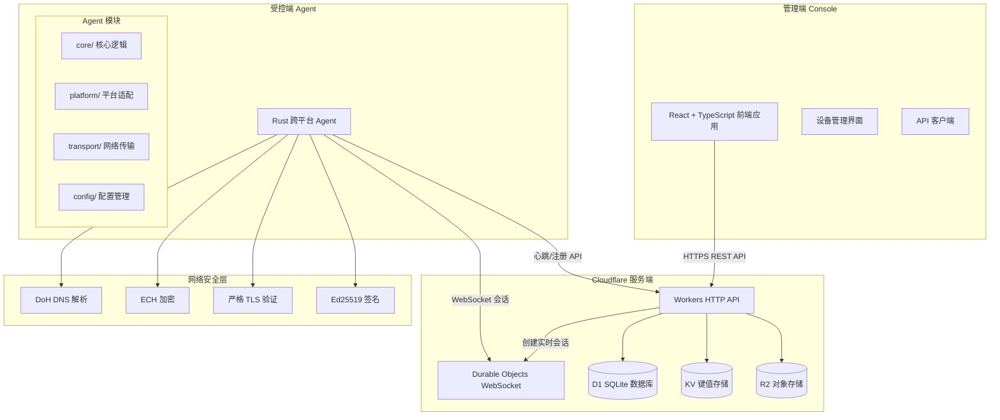
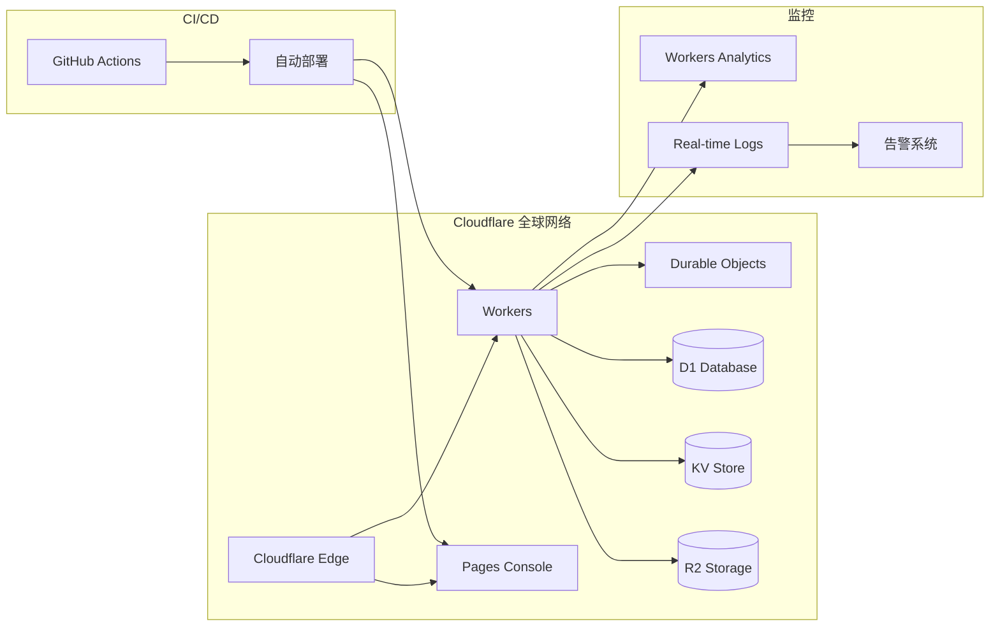
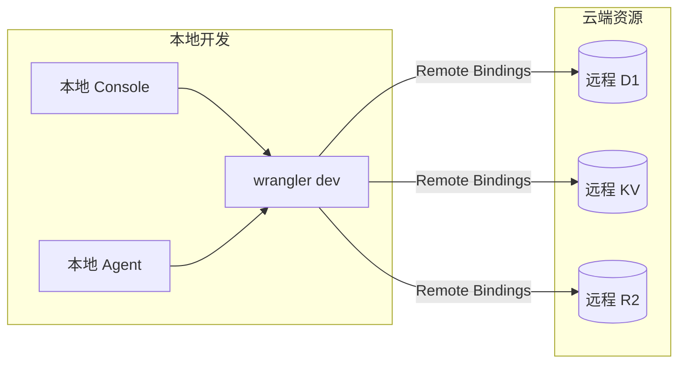

# 轻量化 RMM 系统架构文档

## 概述

轻量化 RMM（Remote Monitoring and Management）系统是一个基于 Cloudflare 平台的三端架构远程设备管理解决方案。系统采用现代化的技术栈，提供设备注册、实时监控、远程命令执行和文件管理等核心功能。

## 系统架构

### 整体架构图



### 技术栈

#### 服务端 (Cloudflare Workers)
- **运行时**: Cloudflare Workers V8 Runtime
- **语言**: TypeScript
- **框架**: itty-router (轻量级路由框架)
- **数据库**: Cloudflare D1 (SQLite)
- **缓存**: Cloudflare KV
- **存储**: Cloudflare R2 (S3 兼容)
- **实时通信**: Durable Objects + WebSocket

#### 受控端 Agent (Rust)
- **语言**: Rust 2021 Edition
- **异步运行时**: Tokio
- **HTTP 客户端**: Reqwest
- **WebSocket**: Tokio-tungstenite
- **加密**: Ed25519-dalek, Ring
- **配置**: TOML, Serde
- **跨平台**: 条件编译 + Trait 抽象

#### 管理端 Console (React)
- **框架**: React 18 + TypeScript
- **构建工具**: Vite
- **UI 库**: Tailwind CSS + Shadcn/ui
- **状态管理**: React Hooks
- **HTTP 客户端**: Fetch API

## 核心组件设计

### 1. 服务端组件

#### Workers HTTP API
负责处理所有 REST API 请求，包括设备管理、会话控制和文件操作。

```typescript
interface WorkerAPI {
  // 设备管理
  'POST /agent/enroll': (token: string) => EnrollResponse
  'POST /agent/heartbeat': (heartbeat: HeartbeatRequest) => HeartbeatResponse
  'GET /devices': () => DeviceListResponse
  
  // 会话管理
  'POST /sessions': (deviceId: string) => SessionResponse
  'GET /sessions/:id': () => SessionStatus
  'DELETE /sessions/:id': () => void
  
  // 文件管理
  'POST /files/list': (deviceId: string, path: string) => FileListResponse
  'GET /files/download': (deviceId: string, path: string) => FileContent
  'POST /files/upload': (deviceId: string, file: FileData) => UploadResponse
  
  // 审计日志
  'GET /audit': (filters: AuditFilters) => AuditResponse
  
  // 健康检查
  'GET /health': () => HealthResponse
}
```

#### Durable Objects WebSocket 会话
每个实时会话对应一个 Durable Object 实例，提供状态一致性和会话隔离。

```typescript
interface SessionDurableObject {
  // WebSocket 连接管理
  handleWebSocket(websocket: WebSocket): void
  
  // 会话状态管理
  getSessionState(): SessionState
  updateSessionState(state: Partial<SessionState>): void
  
  // 消息路由
  routeMessage(message: WSMessage): void
  
  // 会话清理
  cleanup(): void
}
```

### 2. Agent 组件架构

#### 核心模块 (core/)
- **enrollment.rs**: 设备注册逻辑
- **heartbeat.rs**: 心跳监控
- **protocol.rs**: 通信协议实现
- **crypto.rs**: 加密签名验证
- **state.rs**: Agent 状态管理
- **scheduler.rs**: 任务调度器

#### 平台适配层 (platform/)
- **mod.rs**: 平台抽象 Trait 定义
- **windows.rs**: Windows 平台实现
- **linux.rs**: Linux 平台实现
- **macos.rs**: macOS 平台实现

#### 网络传输层 (transport/)
- **http.rs**: HTTP 客户端封装
- **websocket.rs**: WebSocket 客户端
- **security.rs**: 网络安全增强 (DoH/ECH)

#### 配置管理 (config/)
- **config.rs**: 配置结构定义
- **manager.rs**: 配置热更新
- **validation.rs**: 配置验证

### 3. Console 组件

#### 页面组件
- **DevicesPage**: 设备列表和管理
- **SessionsPage**: 实时会话管理
- **AuditPage**: 审计日志查看
- **SettingsPage**: 系统设置

#### 核心服务
- **api-client.ts**: API 客户端封装
- **websocket.ts**: WebSocket 连接管理
- **auth.ts**: 认证状态管理

## 数据模型

### 数据库 Schema (D1)

```sql
-- 设备表
CREATE TABLE devices (
    id TEXT PRIMARY KEY,
    name TEXT NOT NULL,
    platform TEXT NOT NULL,
    version TEXT NOT NULL,
    public_key TEXT NOT NULL,
    last_seen DATETIME,
    status TEXT DEFAULT 'offline',
    created_at DATETIME DEFAULT CURRENT_TIMESTAMP,
    updated_at DATETIME DEFAULT CURRENT_TIMESTAMP
);

-- 会话表
CREATE TABLE sessions (
    id TEXT PRIMARY KEY,
    device_id TEXT NOT NULL,
    type TEXT NOT NULL,
    status TEXT DEFAULT 'active',
    created_at DATETIME DEFAULT CURRENT_TIMESTAMP,
    ended_at DATETIME,
    FOREIGN KEY (device_id) REFERENCES devices(id)
);

-- 审计日志表
CREATE TABLE audit_logs (
    id INTEGER PRIMARY KEY AUTOINCREMENT,
    device_id TEXT,
    session_id TEXT,
    action TEXT NOT NULL,
    details TEXT,
    result TEXT,
    timestamp DATETIME DEFAULT CURRENT_TIMESTAMP,
    FOREIGN KEY (device_id) REFERENCES devices(id),
    FOREIGN KEY (session_id) REFERENCES sessions(id)
);

-- 文件操作表
CREATE TABLE file_operations (
    id INTEGER PRIMARY KEY AUTOINCREMENT,
    device_id TEXT NOT NULL,
    session_id TEXT,
    operation TEXT NOT NULL,
    path TEXT NOT NULL,
    size INTEGER,
    checksum TEXT,
    status TEXT DEFAULT 'pending',
    created_at DATETIME DEFAULT CURRENT_TIMESTAMP,
    completed_at DATETIME,
    FOREIGN KEY (device_id) REFERENCES devices(id),
    FOREIGN KEY (session_id) REFERENCES sessions(id)
);
```

### KV 存储结构

```typescript
interface KVStructure {
  // 注册令牌 (TTL: 1小时)
  'enrollment:token:{token}': {
    created_at: string
    expires_at: string
    used: boolean
  }
  
  // 设备 nonce (TTL: 5分钟)
  'nonce:{device_id}:{nonce}': {
    timestamp: string
  }
  
  // 速率限制 (TTL: 1分钟)
  'rate_limit:{ip}': {
    count: number
    reset_at: string
  }
  
  // 会话缓存 (TTL: 1小时)
  'session:{session_id}': {
    device_id: string
    status: string
    created_at: string
  }
}
```

## 通信协议

### HTTP API 协议

#### 设备注册
```http
POST /agent/enroll
Content-Type: application/json

{
  "enrollment_token": "eyJ0eXAiOiJKV1QiLCJhbGciOiJIUzI1NiJ9...",
  "device_info": {
    "name": "DESKTOP-ABC123",
    "platform": "windows",
    "version": "0.1.0"
  },
  "public_key": "302a300506032b657003210000..."
}
```

#### 心跳协议
```http
POST /agent/heartbeat
Content-Type: application/json
X-Device-ID: device_123
X-Signature: ed25519_signature
X-Nonce: random_nonce

{
  "timestamp": "2024-01-01T00:00:00Z",
  "status": "online",
  "system_info": {
    "cpu_usage": 45.2,
    "memory_usage": 67.8,
    "disk_usage": 23.1
  }
}
```

### WebSocket 协议

#### 消息格式
```typescript
interface WSMessage {
  id: string
  type: 'command' | 'file_op' | 'response' | 'error'
  payload: any
  timestamp: string
}
```

#### 命令执行
```json
{
  "id": "cmd_123",
  "type": "command",
  "payload": {
    "command": "systeminfo",
    "args": [],
    "timeout": 30
  },
  "timestamp": "2024-01-01T00:00:00Z"
}
```

## 安全设计

### 认证与授权
1. **设备注册**: 基于时效性 enrollment token
2. **API 认证**: Ed25519 签名验证
3. **重放攻击防护**: Nonce 机制
4. **会话安全**: WebSocket 连接身份验证

### 网络安全
1. **TLS 验证**: 严格证书验证和证书固定
2. **DoH 支持**: DNS over HTTPS 防劫持
3. **ECH 支持**: Encrypted Client Hello 隐私保护
4. **多层加密**: TLS + 应用层签名

### 数据安全
1. **敏感数据加密**: 私钥本地存储加密
2. **审计日志**: 完整操作记录
3. **权限控制**: 基于路径的文件访问控制
4. **数据完整性**: 文件传输校验和验证

## 部署架构

### 生产环境


### 开发环境


## 性能特征

### 延迟指标
- **API 响应时间**: < 100ms (P95)
- **WebSocket 连接**: < 200ms
- **文件传输**: 取决于文件大小和网络条件
- **心跳间隔**: 30秒 (可配置)

### 吞吐量限制
- **并发连接**: 受 Durable Objects 限制
- **API 请求**: 受 Workers 请求限制
- **文件大小**: 最大 100MB (可配置)
- **数据库**: D1 读写性能限制

### 扩展性
- **水平扩展**: Cloudflare 全球边缘网络自动扩展
- **垂直扩展**: 通过配置调整资源限制
- **地理分布**: 全球 CDN 网络就近访问

## 监控与可观测性

### 关键指标
- **设备在线率**: 活跃设备 / 总设备数
- **API 成功率**: 成功请求 / 总请求数
- **会话成功率**: 成功建立的会话比例
- **错误率**: 各类错误的发生频率

### 日志记录
- **访问日志**: 所有 API 请求记录
- **错误日志**: 异常和错误详情
- **审计日志**: 关键操作记录
- **性能日志**: 响应时间和资源使用

### 告警机制
- **设备离线告警**: 设备长时间未心跳
- **API 错误告警**: 错误率超过阈值
- **性能告警**: 响应时间异常
- **安全告警**: 异常访问模式

## 故障恢复

### 高可用性
- **多区域部署**: Cloudflare 全球网络
- **自动故障转移**: Workers 自动路由
- **数据备份**: D1 自动备份机制
- **会话恢复**: Agent 自动重连

### 灾难恢复
- **数据恢复**: 从备份恢复数据库
- **服务回滚**: 快速回滚到稳定版本
- **配置恢复**: 配置文件版本控制
- **监控恢复**: 监控系统独立部署

这个架构文档提供了系统的全面技术视图，涵盖了从组件设计到部署运维的各个方面，为开发、部署和维护提供了详细的技术指导。