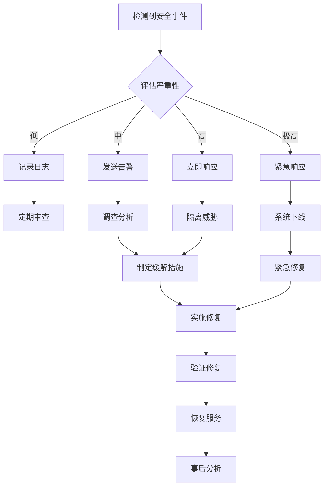

# 安全威胁模型与最佳实践

## 概述

轻量化 RMM 系统作为远程设备管理解决方案，面临多种安全威胁。本文档详细分析了系统的威胁模型，并提供了相应的安全防护措施和最佳实践指导。

## 威胁模型分析

### 1. 攻击面分析

#### 网络攻击面
- **HTTP/HTTPS API 端点**: 设备注册、心跳、文件操作等接口
- **WebSocket 连接**: 实时会话通信通道
- **DNS 解析**: 域名解析过程可能被劫持
- **TLS 连接**: 传输层加密可能被中间人攻击

#### 系统攻击面
- **Agent 进程**: 运行在受控设备上的客户端程序
- **配置文件**: 包含敏感信息的配置数据
- **私钥存储**: 设备身份认证密钥
- **日志文件**: 可能包含敏感操作信息

#### 数据攻击面
- **数据库**: 设备信息、会话记录、审计日志
- **KV 存储**: 临时数据、缓存、令牌
- **文件传输**: 上传下载的文件内容
- **内存数据**: 运行时的敏感信息

### 2. 威胁分类

#### 高风险威胁

**T1: 未授权设备注册**
- **描述**: 攻击者获取有效的注册令牌，注册恶意设备
- **影响**: 系统被恶意设备渗透，可能导致数据泄露
- **可能性**: 中等
- **严重性**: 高

**T2: 中间人攻击 (MITM)**
- **描述**: 攻击者拦截并篡改 Agent 与服务器之间的通信
- **影响**: 敏感数据泄露，恶意命令注入
- **可能性**: 中等
- **严重性**: 高

**T3: 权限提升攻击**
- **描述**: 攻击者利用 Agent 漏洞获取系统管理员权限
- **影响**: 完全控制受控设备
- **可能性**: 低
- **严重性**: 极高

**T4: 数据库注入攻击**
- **描述**: 通过 API 参数注入恶意 SQL 代码
- **影响**: 数据库数据泄露或篡改
- **可能性**: 低
- **严重性**: 高

#### 中风险威胁

**T5: 重放攻击**
- **描述**: 攻击者重放之前捕获的有效请求
- **影响**: 执行未授权操作
- **可能性**: 中等
- **严重性**: 中等

**T6: 拒绝服务攻击 (DoS)**
- **描述**: 大量恶意请求导致服务不可用
- **影响**: 系统服务中断
- **可能性**: 高
- **严重性**: 中等

**T7: 配置文件泄露**
- **描述**: 敏感配置信息被未授权访问
- **影响**: 系统凭证泄露
- **可能性**: 中等
- **严重性**: 中等

**T8: 日志信息泄露**
- **描述**: 日志文件包含敏感信息被泄露
- **影响**: 系统内部信息暴露
- **可能性**: 中等
- **严重性**: 中等

#### 低风险威胁

**T9: 侧信道攻击**
- **描述**: 通过时间、功耗等侧信道信息推断敏感数据
- **影响**: 密钥信息泄露
- **可能性**: 低
- **严重性**: 中等

**T10: 物理访问攻击**
- **描述**: 攻击者物理访问设备获取敏感信息
- **影响**: 本地数据泄露
- **可能性**: 低
- **严重性**: 中等

## 安全防护措施

### 1. 身份认证与授权

#### Ed25519 数字签名
```rust
// agent/src/core/crypto.rs
use ed25519_dalek::{Keypair, Signature, Signer, Verifier};
use rand::rngs::OsRng;

pub struct DeviceIdentity {
    keypair: Keypair,
    device_id: String,
}

impl DeviceIdentity {
    pub fn new() -> Self {
        let mut csprng = OsRng {};
        let keypair = Keypair::generate(&mut csprng);
        let device_id = Self::generate_device_id(&keypair.public);
        
        Self { keypair, device_id }
    }
    
    pub fn sign_request(&self, method: &str, path: &str, body: &str, nonce: &str, timestamp: u64) -> Signature {
        let message = format!("{}|{}|{}|{}|{}", method, path, body, nonce, timestamp);
        self.keypair.sign(message.as_bytes())
    }
    
    pub fn verify_signature(&self, message: &[u8], signature: &Signature) -> bool {
        self.keypair.public.verify(message, signature).is_ok()
    }
}
```

#### 注册令牌机制
```typescript
// server/src/utils/enrollment.ts
import jwt from '@tsndr/cloudflare-worker-jwt'

export class EnrollmentTokenManager {
  static async generateToken(expiresIn: number = 3600): Promise<string> {
    const payload = {
      type: 'enrollment',
      iat: Math.floor(Date.now() / 1000),
      exp: Math.floor(Date.now() / 1000) + expiresIn,
      jti: crypto.randomUUID()
    }
    
    return await jwt.sign(payload, env.JWT_SECRET)
  }
  
  static async validateToken(token: string): Promise<boolean> {
    try {
      const isValid = await jwt.verify(token, env.JWT_SECRET)
      if (!isValid) return false
      
      const { payload } = jwt.decode(token)
      
      // 检查令牌类型
      if (payload.type !== 'enrollment') return false
      
      // 检查是否已使用
      const used = await env.KV.get(`enrollment:used:${payload.jti}`)
      if (used) return false
      
      // 标记为已使用
      await env.KV.put(`enrollment:used:${payload.jti}`, 'true', {
        expirationTtl: payload.exp - payload.iat
      })
      
      return true
    } catch {
      return false
    }
  }
}
```

### 2. 通信安全

#### TLS 配置强化
```rust
// agent/src/transport/http.rs
use reqwest::ClientBuilder;
use std::time::Duration;

pub fn create_secure_client() -> Result<reqwest::Client, reqwest::Error> {
    ClientBuilder::new()
        .timeout(Duration::from_secs(30))
        .connect_timeout(Duration::from_secs(10))
        .min_tls_version(reqwest::tls::Version::TLS_1_2)
        .https_only(true)
        .tls_built_in_root_certs(false)  // 禁用内置根证书
        .add_root_certificate(load_pinned_certificate()?)
        .build()
}

fn load_pinned_certificate() -> Result<reqwest::Certificate, Box<dyn std::error::Error>> {
    let cert_pem = include_str!("../certs/server.pem");
    Ok(reqwest::Certificate::from_pem(cert_pem.as_bytes())?)
}
```

#### 证书固定 (Certificate Pinning)
```rust
// agent/src/core/security.rs
use sha2::{Sha256, Digest};
use base64::{Engine as _, engine::general_purpose};

pub struct CertificatePinner {
    pinned_hashes: Vec<String>,
}

impl CertificatePinner {
    pub fn new(pins: Vec<String>) -> Self {
        Self { pinned_hashes: pins }
    }
    
    pub fn verify_certificate(&self, cert_der: &[u8]) -> bool {
        let mut hasher = Sha256::new();
        hasher.update(cert_der);
        let hash = hasher.finalize();
        let hash_b64 = general_purpose::STANDARD.encode(&hash);
        let hash_pin = format!("sha256:{}", hash_b64);
        
        self.pinned_hashes.contains(&hash_pin)
    }
}
```

#### DNS over HTTPS (DoH)
```rust
// agent/src/transport/doh.rs
use reqwest::Client;
use serde_json::Value;

pub struct DoHResolver {
    providers: Vec<String>,
    client: Client,
}

impl DoHResolver {
    pub fn new(providers: Vec<String>) -> Self {
        let client = Client::builder()
            .timeout(Duration::from_secs(5))
            .build()
            .expect("Failed to create DoH client");
            
        Self { providers, client }
    }
    
    pub async fn resolve(&self, domain: &str) -> Result<Vec<std::net::IpAddr>, Box<dyn std::error::Error>> {
        for provider in &self.providers {
            match self.query_provider(provider, domain).await {
                Ok(ips) if !ips.is_empty() => return Ok(ips),
                _ => continue,
            }
        }
        
        Err("All DoH providers failed".into())
    }
    
    async fn query_provider(&self, provider: &str, domain: &str) -> Result<Vec<std::net::IpAddr>, Box<dyn std::error::Error>> {
        let url = format!("{}?name={}&type=A", provider, domain);
        let response: Value = self.client
            .get(&url)
            .header("Accept", "application/dns-json")
            .send()
            .await?
            .json()
            .await?;
            
        let mut ips = Vec::new();
        if let Some(answers) = response["Answer"].as_array() {
            for answer in answers {
                if let Some(ip_str) = answer["data"].as_str() {
                    if let Ok(ip) = ip_str.parse() {
                        ips.push(ip);
                    }
                }
            }
        }
        
        Ok(ips)
    }
}
```

### 3. 防重放攻击

#### Nonce 机制
```typescript
// server/src/utils/nonce.ts
export class NonceManager {
  static async validateNonce(deviceId: string, nonce: string): Promise<boolean> {
    const key = `nonce:${deviceId}:${nonce}`
    
    // 检查 nonce 是否已使用
    const exists = await env.KV.get(key)
    if (exists) {
      return false
    }
    
    // 标记 nonce 为已使用，5分钟过期
    await env.KV.put(key, Date.now().toString(), {
      expirationTtl: 300
    })
    
    return true
  }
  
  static generateNonce(): string {
    const array = new Uint8Array(32)
    crypto.getRandomValues(array)
    return Array.from(array, byte => byte.toString(16).padStart(2, '0')).join('')
  }
}
```

#### 时间戳验证
```rust
// agent/src/core/protocol.rs
use std::time::{SystemTime, UNIX_EPOCH};

pub struct RequestValidator {
    max_time_skew: u64, // 最大时间偏差（秒）
}

impl RequestValidator {
    pub fn new(max_time_skew: u64) -> Self {
        Self { max_time_skew }
    }
    
    pub fn validate_timestamp(&self, timestamp: u64) -> bool {
        let now = SystemTime::now()
            .duration_since(UNIX_EPOCH)
            .unwrap()
            .as_secs();
            
        let diff = if now > timestamp {
            now - timestamp
        } else {
            timestamp - now
        };
        
        diff <= self.max_time_skew
    }
}
```

### 4. 输入验证与过滤

#### API 参数验证
```typescript
// server/src/utils/validation.ts
import { z } from 'zod'

export const DeviceEnrollmentSchema = z.object({
  enrollment_token: z.string().min(1),
  device_info: z.object({
    name: z.string().min(1).max(255).regex(/^[a-zA-Z0-9\-_\.]+$/),
    platform: z.enum(['windows', 'linux', 'macos']),
    version: z.string().regex(/^\d+\.\d+\.\d+$/),
    architecture: z.string().optional()
  }),
  public_key: z.string().regex(/^[0-9a-fA-F]+$/)
})

export const HeartbeatSchema = z.object({
  timestamp: z.string().datetime(),
  status: z.enum(['online', 'offline', 'maintenance']),
  system_info: z.object({
    cpu_usage: z.number().min(0).max(100),
    memory_usage: z.number().min(0).max(100),
    disk_usage: z.number().min(0).max(100),
    uptime: z.number().min(0),
    load_average: z.array(z.number()).optional()
  }).optional()
})

export function validateRequest<T>(schema: z.ZodSchema<T>, data: unknown): T {
  try {
    return schema.parse(data)
  } catch (error) {
    throw new Error(`Validation failed: ${error.message}`)
  }
}
```

#### 路径遍历防护
```rust
// agent/src/core/file_security.rs
use std::path::{Path, PathBuf};

pub struct PathSecurityPolicy {
    allowed_paths: Vec<PathBuf>,
    blocked_paths: Vec<PathBuf>,
    allow_hidden: bool,
}

impl PathSecurityPolicy {
    pub fn validate_path(&self, path: &Path) -> Result<PathBuf, SecurityError> {
        // 规范化路径，防止路径遍历
        let canonical = path.canonicalize()
            .map_err(|_| SecurityError::InvalidPath)?;
        
        // 检查是否包含隐藏文件
        if !self.allow_hidden && self.contains_hidden_component(&canonical) {
            return Err(SecurityError::HiddenFileAccess);
        }
        
        // 检查是否在阻止列表中
        for blocked in &self.blocked_paths {
            if canonical.starts_with(blocked) {
                return Err(SecurityError::BlockedPath);
            }
        }
        
        // 检查是否在允许列表中
        if !self.allowed_paths.is_empty() {
            let allowed = self.allowed_paths.iter()
                .any(|allowed| canonical.starts_with(allowed));
            if !allowed {
                return Err(SecurityError::UnauthorizedPath);
            }
        }
        
        Ok(canonical)
    }
    
    fn contains_hidden_component(&self, path: &Path) -> bool {
        path.components().any(|component| {
            if let std::path::Component::Normal(name) = component {
                name.to_string_lossy().starts_with('.')
            } else {
                false
            }
        })
    }
}

#[derive(Debug)]
pub enum SecurityError {
    InvalidPath,
    HiddenFileAccess,
    BlockedPath,
    UnauthorizedPath,
}
```

### 5. 数据保护

#### 敏感数据加密
```rust
// agent/src/core/encryption.rs
use aes_gcm::{Aes256Gcm, Key, Nonce, aead::{Aead, NewAead}};
use rand::{RngCore, OsRng};

pub struct DataEncryption {
    cipher: Aes256Gcm,
}

impl DataEncryption {
    pub fn new(key: &[u8; 32]) -> Self {
        let key = Key::from_slice(key);
        let cipher = Aes256Gcm::new(key);
        Self { cipher }
    }
    
    pub fn encrypt(&self, plaintext: &[u8]) -> Result<Vec<u8>, aes_gcm::Error> {
        let mut nonce_bytes = [0u8; 12];
        OsRng.fill_bytes(&mut nonce_bytes);
        let nonce = Nonce::from_slice(&nonce_bytes);
        
        let mut ciphertext = self.cipher.encrypt(nonce, plaintext)?;
        
        // 将 nonce 前置到密文
        let mut result = nonce_bytes.to_vec();
        result.append(&mut ciphertext);
        
        Ok(result)
    }
    
    pub fn decrypt(&self, ciphertext: &[u8]) -> Result<Vec<u8>, aes_gcm::Error> {
        if ciphertext.len() < 12 {
            return Err(aes_gcm::Error);
        }
        
        let (nonce_bytes, encrypted_data) = ciphertext.split_at(12);
        let nonce = Nonce::from_slice(nonce_bytes);
        
        self.cipher.decrypt(nonce, encrypted_data)
    }
}
```

#### 安全的密钥存储
```rust
// agent/src/core/keystore.rs
use std::fs::{File, OpenOptions};
use std::io::{Read, Write};
use std::os::unix::fs::PermissionsExt;

pub struct SecureKeystore {
    key_path: PathBuf,
}

impl SecureKeystore {
    pub fn new(key_path: PathBuf) -> Self {
        Self { key_path }
    }
    
    pub fn store_key(&self, key_data: &[u8]) -> Result<(), std::io::Error> {
        // 创建文件并设置严格权限 (600)
        let mut file = OpenOptions::new()
            .create(true)
            .write(true)
            .truncate(true)
            .open(&self.key_path)?;
            
        // 设置文件权限为仅所有者可读写
        let mut perms = file.metadata()?.permissions();
        perms.set_mode(0o600);
        file.set_permissions(perms)?;
        
        file.write_all(key_data)?;
        file.sync_all()?;
        
        Ok(())
    }
    
    pub fn load_key(&self) -> Result<Vec<u8>, std::io::Error> {
        let mut file = File::open(&self.key_path)?;
        let mut key_data = Vec::new();
        file.read_to_end(&mut key_data)?;
        Ok(key_data)
    }
}
```

### 6. 审计与监控

#### 安全事件记录
```typescript
// server/src/utils/security-audit.ts
export enum SecurityEventType {
  AUTHENTICATION_FAILURE = 'auth_failure',
  INVALID_SIGNATURE = 'invalid_signature',
  NONCE_REUSE = 'nonce_reuse',
  RATE_LIMIT_EXCEEDED = 'rate_limit_exceeded',
  SUSPICIOUS_ACTIVITY = 'suspicious_activity',
  PRIVILEGE_ESCALATION = 'privilege_escalation'
}

export class SecurityAuditor {
  static async logSecurityEvent(
    eventType: SecurityEventType,
    deviceId: string | null,
    details: Record<string, any>,
    severity: 'low' | 'medium' | 'high' | 'critical' = 'medium'
  ) {
    const event = {
      id: crypto.randomUUID(),
      type: eventType,
      device_id: deviceId,
      details,
      severity,
      timestamp: new Date().toISOString(),
      source_ip: details.sourceIp || 'unknown'
    }
    
    // 记录到数据库
    await env.DB.prepare(`
      INSERT INTO security_events (id, type, device_id, details, severity, timestamp, source_ip)
      VALUES (?, ?, ?, ?, ?, ?, ?)
    `).bind(
      event.id,
      event.type,
      event.device_id,
      JSON.stringify(event.details),
      event.severity,
      event.timestamp,
      event.source_ip
    ).run()
    
    // 高严重性事件立即告警
    if (severity === 'high' || severity === 'critical') {
      await this.sendSecurityAlert(event)
    }
  }
  
  private static async sendSecurityAlert(event: any) {
    // 发送告警通知
    console.error('SECURITY ALERT:', JSON.stringify(event))
    
    // 可以集成外部告警系统
    // await sendToSlack(event)
    // await sendEmail(event)
  }
}
```

#### 异常行为检测
```typescript
// server/src/utils/anomaly-detection.ts
export class AnomalyDetector {
  static async detectSuspiciousActivity(deviceId: string, activity: any): Promise<boolean> {
    const key = `activity:${deviceId}`
    const recentActivity = await env.KV.get(key, 'json') || []
    
    // 检查请求频率异常
    const now = Date.now()
    const recentRequests = recentActivity.filter((a: any) => now - a.timestamp < 60000) // 1分钟内
    
    if (recentRequests.length > 100) {
      await SecurityAuditor.logSecurityEvent(
        SecurityEventType.SUSPICIOUS_ACTIVITY,
        deviceId,
        { reason: 'high_request_frequency', count: recentRequests.length },
        'high'
      )
      return true
    }
    
    // 检查异常命令模式
    const commands = recentActivity
      .filter((a: any) => a.type === 'command')
      .map((a: any) => a.command)
    
    const suspiciousCommands = commands.filter((cmd: string) => 
      /rm\s+-rf|format|fdisk|del\s+\/[fs]/.test(cmd)
    )
    
    if (suspiciousCommands.length > 0) {
      await SecurityAuditor.logSecurityEvent(
        SecurityEventType.SUSPICIOUS_ACTIVITY,
        deviceId,
        { reason: 'suspicious_commands', commands: suspiciousCommands },
        'critical'
      )
      return true
    }
    
    // 更新活动记录
    recentActivity.push({
      ...activity,
      timestamp: now
    })
    
    // 保留最近1小时的活动记录
    const filteredActivity = recentActivity.filter((a: any) => now - a.timestamp < 3600000)
    
    await env.KV.put(key, JSON.stringify(filteredActivity), {
      expirationTtl: 3600
    })
    
    return false
  }
}
```

## 安全最佳实践

### 1. 开发阶段

#### 安全编码规范
- **输入验证**: 所有外部输入必须经过严格验证
- **输出编码**: 防止 XSS 和注入攻击
- **错误处理**: 不泄露敏感信息的错误消息
- **日志安全**: 避免在日志中记录敏感数据

#### 代码审查清单
```markdown
## 安全代码审查清单

### 认证与授权
- [ ] 所有 API 端点都有适当的认证
- [ ] 权限检查在业务逻辑之前执行
- [ ] 敏感操作需要额外验证

### 输入验证
- [ ] 所有用户输入都经过验证
- [ ] 使用白名单而非黑名单验证
- [ ] 文件路径经过规范化处理

### 加密与签名
- [ ] 使用强加密算法和足够长的密钥
- [ ] 正确实现数字签名验证
- [ ] 敏感数据在存储前加密

### 错误处理
- [ ] 错误消息不泄露系统信息
- [ ] 异常被正确捕获和处理
- [ ] 安全事件被记录到审计日志

### 配置安全
- [ ] 默认配置是安全的
- [ ] 敏感配置项不在代码中硬编码
- [ ] 生产环境禁用调试功能
```

### 2. 部署阶段

#### 基础设施安全
```bash
# 服务器加固脚本
#!/bin/bash

# 更新系统
apt update && apt upgrade -y

# 配置防火墙
ufw default deny incoming
ufw default allow outgoing
ufw allow ssh
ufw allow 443/tcp
ufw enable

# 禁用不必要的服务
systemctl disable apache2
systemctl disable nginx
systemctl disable mysql

# 配置 SSH 安全
sed -i 's/#PermitRootLogin yes/PermitRootLogin no/' /etc/ssh/sshd_config
sed -i 's/#PasswordAuthentication yes/PasswordAuthentication no/' /etc/ssh/sshd_config
systemctl restart ssh

# 安装入侵检测系统
apt install -y fail2ban
systemctl enable fail2ban
systemctl start fail2ban
```

#### 容器安全
```dockerfile
# 使用最小化基础镜像
FROM alpine:3.18

# 创建非特权用户
RUN addgroup -g 1001 rmm && \
    adduser -D -s /bin/sh -u 1001 -G rmm rmm

# 设置安全的文件权限
COPY --chown=rmm:rmm --chmod=755 rmm-agent /usr/local/bin/
COPY --chown=rmm:rmm --chmod=600 config.toml /etc/rmm-agent/

# 切换到非特权用户
USER rmm

# 健康检查
HEALTHCHECK --interval=30s --timeout=3s --start-period=5s --retries=3 \
  CMD rmm-agent --health-check || exit 1

ENTRYPOINT ["/usr/local/bin/rmm-agent"]
```

### 3. 运维阶段

#### 安全监控
```yaml
# 监控配置示例 (Prometheus + Grafana)
groups:
  - name: rmm-security
    rules:
      - alert: HighAuthenticationFailures
        expr: rate(rmm_auth_failures_total[5m]) > 0.1
        for: 2m
        labels:
          severity: warning
        annotations:
          summary: "High authentication failure rate"
          
      - alert: SuspiciousActivity
        expr: rmm_security_events{severity="high"} > 0
        for: 0m
        labels:
          severity: critical
        annotations:
          summary: "Suspicious security activity detected"
          
      - alert: CertificateExpiry
        expr: (rmm_cert_expiry_timestamp - time()) / 86400 < 30
        for: 1h
        labels:
          severity: warning
        annotations:
          summary: "Certificate expiring in less than 30 days"
```

#### 定期安全检查
```bash
#!/bin/bash
# 安全检查脚本

echo "=== RMM 系统安全检查 ==="

# 检查证书有效期
echo "检查 TLS 证书..."
openssl s_client -connect your-rmm-server.example.com:443 -servername your-rmm-server.example.com < /dev/null 2>/dev/null | openssl x509 -noout -dates

# 检查 Agent 进程权限
echo "检查 Agent 进程..."
ps aux | grep rmm-agent | grep -v grep

# 检查配置文件权限
echo "检查配置文件权限..."
ls -la /etc/rmm-agent/

# 检查日志中的安全事件
echo "检查安全事件..."
grep -i "security\|auth\|fail" /var/log/rmm-agent/agent.log | tail -10

# 检查网络连接
echo "检查网络连接..."
netstat -tulpn | grep rmm-agent

echo "=== 检查完成 ==="
```

### 4. 事件响应

#### 安全事件响应流程


#### 事件响应手册
```markdown
## 安全事件响应手册

### 1. 检测阶段
- 监控告警触发
- 异常行为检测
- 用户报告

### 2. 分析阶段
- 确认事件真实性
- 评估影响范围
- 确定攻击向量

### 3. 遏制阶段
- 隔离受影响系统
- 阻止攻击扩散
- 保护关键资产

### 4. 根除阶段
- 清除恶意代码
- 修复安全漏洞
- 更新安全策略

### 5. 恢复阶段
- 恢复系统服务
- 验证系统安全
- 监控异常活动

### 6. 总结阶段
- 事件分析报告
- 改进安全措施
- 更新应急预案
```

## 合规性要求

### 1. 数据保护法规

#### GDPR 合规
- **数据最小化**: 只收集必要的设备信息
- **用户同意**: 明确告知数据收集目的
- **数据删除**: 提供设备注销和数据删除功能
- **数据可移植**: 支持数据导出功能

#### 其他法规
- **SOX**: 审计日志完整性和不可篡改性
- **HIPAA**: 医疗环境下的额外加密要求
- **PCI DSS**: 支付相关数据的特殊保护

### 2. 行业标准

#### ISO 27001
- 信息安全管理体系
- 风险评估和管理
- 持续改进流程

#### NIST 网络安全框架
- 识别 (Identify)
- 保护 (Protect)
- 检测 (Detect)
- 响应 (Respond)
- 恢复 (Recover)

这个安全指南提供了全面的威胁分析和防护措施，涵盖了从开发到运维的各个阶段，确保系统能够抵御各种安全威胁并满足合规性要求。